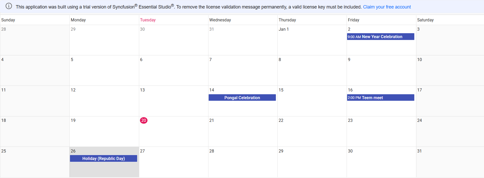

# Getting Started with React Scheduler Component using MERN stack (MongoDB, Express, React, Node)

## Description

This repository showcases a full‑stack sample application that demonstrates how to integrate the Syncfusion React Scheduler component into a React application with a Node.js and MongoDB backend.<br />
The backend provides REST API endpoints for managing calendar events, which are stored in MongoDB. The React frontend delivers a responsive scheduling interface, enabling users to create, update, view, and delete events seamlessly using Syncfusion’s Scheduler component.

## Prerequisites
- Use Node Version >= 20.19.0 (for better performance with MongoDB driver 7.0)
- Use Latest MongoDB Software.
- Make sure there is nothing running on the ports 5000, 3000.

## Setup
- Clone the repository to your local machine.

### Backend Setup

#### <u> MongoDB </u>

1. Create a Database named `mydb` in the default connection `localhost:27017` in MongoDB Compass.
2. Create a Collection named `ScheduleData` in the above created database.
3. Make sure this connection is in connected state in MongoDB Compass.

### Frontend Setup
1. In a new terminal, navigate to the project folder:
2. Install application dependencies:
    ```bash
    npm install
    ```

## Running the Application
1. Start the backend server:
    ```bash
    npm run server (runs the server.js file)
    ```
2. Backend server started running on `http://localhost:5000`
3. Open another terminal from the same path, start the frontend:
    ```bash
    npm start
    ```
4. Access the application by navigating to [http://localhost:3000](http://localhost:3000) in your web browser to view the output.

## Output Preview
**Syncfusion React Scheduler**

*Image illustrating the Syncfusion React Scheduler* 

## Troubleshooting
- **404 PageNotFound**: Ensure the backend server running on `localhost:5000`.
- **CORS errors**: Ensure the frontend running on `localhost:3000`.

## Learn More

To learn more about integrating Syncfusion React Scheduler [Syncfusion Documentation](https://ej2.syncfusion.com/react/documentation/schedule/getting-started).