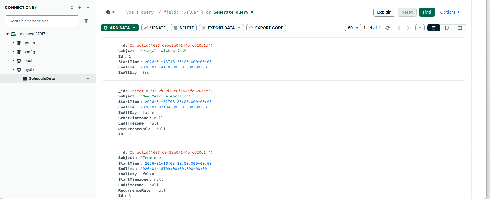

# Getting Started with React Scheduler Component using MERN stack (MongoDB, Express, React, Node)

## Description

This repository showcases a full‑stack sample application that demonstrates how to integrate the Syncfusion React Scheduler component into a React application with a Node.js and MongoDB backend.<br />
The backend provides REST API endpoints for managing calendar events, which are stored in MongoDB. The React frontend delivers a responsive scheduling interface, enabling users to create, update, view, and delete events seamlessly using Syncfusion’s Scheduler component.

<br />

## Prerequisites
- Use Node Version >= 20.19.0 (for better performance with MongoDB driver 7.0)
- Use Latest MongoDB Software.
- Make sure there is nothing running on the ports 5000, 3000.

<br />

## Project Structure
```
├── public
│     ├── index.html           
├── server                     
│     ├── server.js            
├── src
│     ├── App.css              
│     ├── App.test.tsx
│     ├── App.tsx
│     ├── index.css
│     ├── index.tsx
│     ├── react-app-env.d.ts
│     ├── serviceWorker.ts
│     └── setupTest.ts
├── package-lock.json
├── package.json
├── README.md                   
└── tsconfig.json
```

<br />

## Backend Setup

#### <u> MongoDB </u>

1. Create a Database named `mydb` in the default connection `localhost:27017` in MongoDB Compass.
2. Create a Collection named `ScheduleData` in the above created database.
3. Make sure this connection is in connected state in MongoDB Compass.

#### <u> Available Endpoints </u>
The Express server (`server.js`) exposes the following REST routes:
| Method | URL                          | Description                         |
| ------ | ---------------------------- | ----------------------------------- |
| POST   | `/GetData`    | Fetch all the events |
| POST   | `/BatchData`  | Insert/Update/Delete event                  |

<br />

## Frontend Setup

#### <u> Installation </u>
1. In a new terminal, navigate to the project folder:
2. Install application dependencies:
    ```bash
    npm install
    ```
<br />

## Running the Application
1. Navigate to the project folder.
2. Start the backend server:
    ```bash
    npm run server (runs the server.js file)
    ```
3. Backend server started running on `http://localhost:5000`
4. Start the frontend:
    ```bash
    npm start
    ```
5. Navigate to [http://localhost:3000](http://localhost:3000) in your browser.<br />
    The page will reload if you make edits.<br />
    You will also see any lint errors in the console.

<br />

## Sample Outputs

*Image illustrating the Syncfusion React Scheduler* 


*Image illustrating the events of the Syncfusion React Scheduler in the MongoDB* 

<br />

## Troubleshooting
- **404 PageNotFound**: Ensure the backend server running on `localhost:5000`.
- **CORS errors**: Ensure the frontend running on `localhost:3000`.

<br />
<br />
<br />
<br />

# Creating a MERN (MongoDB, Express, React, Node) Application Using Syncfusion® React Scheduler Component

## Prerequisites
- Use Node Version >= 20.19.0 (for better performance with MongoDB driver 7.0)
- Use Latest MongoDB Software.
- Make sure there is nothing running on the ports 5000, 5174.

<br />

## Database Setup

#### <u> MongoDB </u>

1. Download the mongoDB software from the below given link.
    - https://www.mongodb.com/try/download/community
2. Open MongoDB Compass, Create a Database in the connection
3. Create a Collection inside the above created database.
4. Make sure this connection is in connected state in MongoDB Compass.

<br />

## Application Setup

#### <u> React </u>

1. To create new React Application, run the following command
    - To create React & choose Typescript manually 
        ```bash
        npm create vite@latest my-app
        ```
        Or
    - To create React Application with Typescript using template
        ```bash
        npm create vite@latest my-app -- --template react-ts
        cd my-app
        npm run dev
        ```

2. Adding Syncfusion packages 
    ```bash
        npm install @syncfusion/ej2-react-schedule --save
    ```

3. Adding css references in `src/App.css`
    - Option 1 -  Adding individual references 
        ```bash
        @import "../node_modules/@syncfusion/ej2-base/styles/material.css";
        @import "../node_modules/@syncfusion/ej2-buttons/styles/material.css";
        @import "../node_modules/@syncfusion/ej2-calendars/styles/material.css";
        @import "../node_modules/@syncfusion/ej2-dropdowns/styles/material.css";
        @import "../node_modules/@syncfusion/ej2-inputs/styles/material.css";
        @import "../node_modules/@syncfusion/ej2-lists/styles/material.css";
        @import "../node_modules/@syncfusion/ej2-navigations/styles/material.css";
        @import "../node_modules/@syncfusion/ej2-popups/styles/material.css";
        @import "../node_modules/@syncfusion/ej2-splitbuttons/styles/material.css";
        @import "../node_modules/@syncfusion/ej2-react-schedule/styles/material.css";
        ```
        Or
    - Option 2 - If you want to use combined css files, then use the following code
        ```bash
        @import '../../node_modules/@syncfusion/ej2/material.css';
        ```
    2. Import the `App.css` file in the `App.tsx` file. 

4. **<u>Server Setup</u>**
    1. Create a separate folder `server` for server file(`server.js`) inside the `my-app/`.
    2. From this root folder `my-app/`, run the following commands to install the needed packages for the communication between frontend and backend
        ```bash
            npm install mongodb
        ``` 
        ```bash
            npm install express
        ```  
        ```bash
            npm install cors
        ``` 
    3. Using Express create API Endpoints and functionalities as per our need and make communication with the DB using MongoClient    
        For your reference
        ```bash
        var MongoClient = require('mongodb').MongoClient;
        var express = require('express');
        var cors = require('cors');
        var app = express();
        var url = "mongodb://localhost:27017/";

        app.use(express.json());
        app.use(express.urlencoded({ extended: false }));

        // Put CORS BEFORE any routes
        app.use(cors({
            origin: 'http://localhost:5174', // your React dev server
            methods: ['GET', 'POST', 'PUT', 'PATCH', 'DELETE', 'OPTIONS'],
            allowedHeaders: ['Content-Type', 'Authorization'],
            credentials: false // set to true ONLY if you use cookies/Authorization with cross-origin
        }));

        app.use(express.static(__dirname));
        app.listen(5000, function () { console.log('listening on 5000'); });

        (async () => {
            try {
                const client = new MongoClient(url);
                await client.connect();
                const dbo = client.db('mydb');

                app.post("/GetData", async function (req, res) {
                    try {
                        const cus = await dbo.collection('ScheduleData').find({}).toArray();
                        res.json(cus);
                    } catch (err) {
                        res.status(500).json({ error: 'DB error', details: err.message });
                    }
                });

                app.post("/BatchData", async function (req, res) {
                    try {
                        let eventData = [];
                        if (req.body.action === "insert" || (req.body.action === "batch" && req.body.added && req.body.added.length > 0)) {
                            (req.body.action === "insert") ? eventData.push(req.body.value) : eventData = req.body.added;
                            for (let a = 0; a < eventData.length; a++) {
                                eventData[a].StartTime = new Date(eventData[a].StartTime);
                                eventData[a].EndTime = new Date(eventData[a].EndTime);
                                await dbo.collection('ScheduleData').insertOne(eventData[a]);
                            }
                        }
                        if (req.body.action === "update" || (req.body.action === "batch" && req.body.changed && req.body.changed.length > 0)) {
                            (req.body.action === "update") ? eventData.push(req.body.value) : eventData = req.body.changed;
                            for (let b = 0; b < eventData.length; b++) {
                                delete eventData[b]._id;
                                eventData[b].StartTime = new Date(eventData[b].StartTime);
                                eventData[b].EndTime = new Date(eventData[b].EndTime);
                                await dbo.collection('ScheduleData').updateOne({ "Id": eventData[b].Id }, { $set: eventData[b] });
                            }
                        }
                        if (req.body.action === "remove" || (req.body.action === "batch" && req.body.deleted && req.body.deleted.length > 0)) {
                            (req.body.action === "remove") ? eventData.push({ Id: req.body.key }) : eventData = req.body.deleted;
                            for (let c = 0; c < eventData.length; c++) {
                                await dbo.collection('ScheduleData').deleteOne({ "Id": eventData[c].Id });
                            }
                        }
                        res.json(req.body);
                    } catch (err) {
                        res.status(500).json({ error: 'DB error', details: err.message });
                    }
                });

                // Optional: handle SIGINT to close client
                process.on('SIGINT', async () => {
                    await client.close();
                    process.exit(0);
                });

            } catch (err) {
                console.error('Mongo connection failed:', err);
                process.exit(1);
            }
        })();
        ```
        - Configures CORS to allow the React frontend (localhost:5174) to communicate with the Express backend.
        - Endpoints
            1. POST /GetData – Retrieves all schedule records from the MongoDB ScheduleData collection.
            2. POST /BatchData – Handles insert, update, and delete operations on schedule events based on the incoming request action.                
        - Here Database name is `mydb` and Collection name is `ScheduleData`

    4. Add the following lines in the `package.json`
        ```bash
        "scripts": {
            "start": "vite",
            "server": "node ./server/server.js"
        }
        ``` 
    5. Make sure the address, database name, collection name are must be same as in DB created in Backend Setup.

5. Render the Syncfusion Schedule component as per the need. Refer the below link.
    - https://ej2.syncfusion.com/react/documentation/schedule/getting-started?cs-save-lang=1&cs-lang=ts#initialize-the-schedule
    
    - For your reference
        ```bash
        import React from 'react';
        import { DataManager, UrlAdaptor } from '@syncfusion/ej2-data';
        import { ScheduleComponent, ViewsDirective, ViewDirective, Day, Week, WorkWeek, Month, Agenda, Inject } from '@syncfusion/ej2-react-schedule';
        import './App.css';

        export default class App extends React.Component<{}, {}> {
        public scheduleObj: ScheduleComponent = new ScheduleComponent({});
        private dataManager: DataManager = new DataManager({
            url: 'http://localhost:5000/GetData',
            crudUrl: 'http://localhost:5000/BatchData',
            adaptor: new UrlAdaptor(),
            crossDomain: true
        });

            public render() {
                return (
                
                <div className="control-section">
                    <div className="schedule-control">
                    <ScheduleComponent 
                    id="schedule" 
                    ref={(schedule: ScheduleComponent | null) => { 
                        this.scheduleObj = schedule!;
                        }}
                    height="550px"
                    selectedDate={new Date(2026, 0, 1)} 
                    currentView="Month" 
                    eventSettings={ {dataSource: this.dataManager }}>
                        <ViewsDirective>
                        <ViewDirective option="Day" />
                        <ViewDirective option="Week" />
                        <ViewDirective option="WorkWeek" />
                        <ViewDirective option="Month" />
                        <ViewDirective option="Agenda" />
                        </ViewsDirective>
                        <Inject services={[Day, Week, WorkWeek, Month, Agenda]} />
                    </ScheduleComponent>
                    </div>
                </div>
                );
            }
        }
        ```
        - Getting & Inserting Events done through the DataManager
        - Frontend calls the backend API using http://localhost:5000/GetData to fetch all schedule data from the server
        - Frontend uses http://localhost:5000/BatchData as the CRUD endpoint to add, update, or delete schedule events on the backend.

<br />

## Running the Application
1. Navigate to the project folder `my-app/`.
2. Start the backend server:
    ```bash
    npm run server (runs the server.js file)
    ```
3. Backend server started running on `http://localhost:5000`
4. Start the frontend:
    ```bash
    npm start
    ```
    Or
    ```bash
    npm run dev
    ```
5. Navigate to [http://localhost:5174](http://localhost:5174) in your browser.<br />
    The page will reload if you make edits.<br />
    You will also see any lint errors in the console.

<br />

## Troubleshooting
- **ReferenceError: require is not defined in ES module scope**: Remove {"type":"module"} from the package.json file (to maintain the code as CommonJS module format)
- **404 PageNotFound**: Ensure the backend server running on `localhost:5000`.
- **CORS errors**: Ensure the frontend running on `localhost:5174`.

<br />
<br />
<br />
<br />

# Learn More

To learn more about Syncfusion React Scheduler [Syncfusion Documentation](https://ej2.syncfusion.com/react/documentation/schedule/getting-started).


